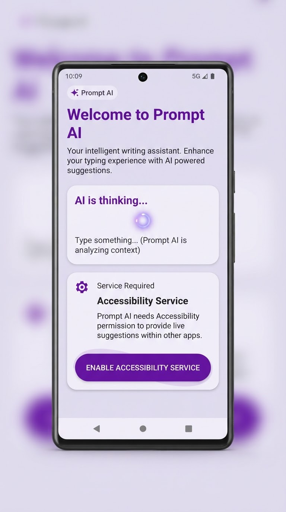
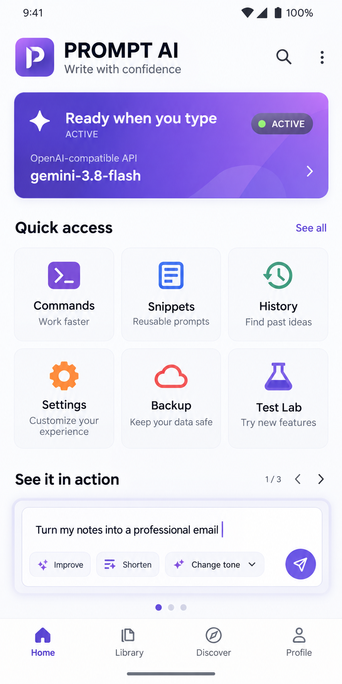
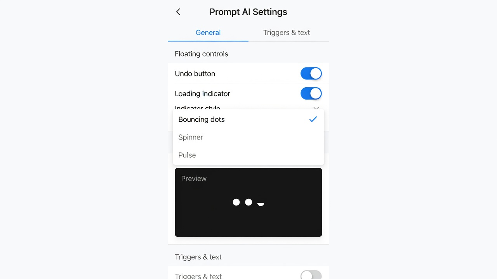

# Prompt AI 🚀

  

  <b>AI writing tools and utilities in every Android text field.</b>

  
  
  
  

Prompt AI is the new display name for this TypeAssist-based Android app. It uses Android Accessibility to trigger AI actions and text utilities with simple commands. The Android package ID remains `com.typeassist.app` for compatibility.

---

## 📸 Screenshots

  <!-- Screenshots -->
  

    
    
    
  

---

## ✨ Features

### 🤖 AI Capabilities
*   **Ask AI:** Query Google Gemini, Cloudflare Workers AI, or **any OpenAI-compatible Custom API** directly from any app.
*   **Live Model Picker:** Load models available to your Gemini key or OpenAI-compatible endpoint, then search, select, favorite, and revisit recent models. Manual model IDs remain supported for providers without a model-list endpoint.
*   **Provider Diagnostics:** Test a setup with clearer guidance for common key, URL, model, quota, and network errors.
*   **Grammar Fix:** Instantly correct spelling, punctuation, and grammar errors.
*   **Translation:** Translate text from any language to English (or your preferred language).
*   **Tone Adjustment:** Rewrite messages to be more professional, polite, or friendly.
*   **Inline Commands:** Embed AI queries within sentences using a configurable inline pattern (the default is `(%:.ta)`, for example `(capital of Japan:.ta)`).
*   **Global Rewrite:** Transform the entire text field with a custom instruction using `...instruction...`.
    *   Example: `meeting at 3pm, bring laptop ...expand to formal invite...`
    *   **Result:** "Please join us for a meeting at 3:00 PM. Kindly remember to bring your laptop as we will be working through some examples together."

### 🛠 Utility Belt (Offline Tools)
*   **Smart Calculator:** Solve math expressions in-place.
    *   Example: `(.c: 25 * 4 + 10)` -> `110`
*   **Snippets (Text Expander):** Expand shortcuts into full text blocks.
    *   Example: `..email` -> `user@example.com`
    *   **Quick Save:** Save new snippets instantly without opening the app: `(.save:trigger:content)`
*   **Date & Time:** Insert current timestamps with `.now` or `.date`.
*   **Password Generator:** Generate strong random passwords on the fly with `.pass`.

### 💾 Data Management
*   **Backup & Restore:** Export your settings, snippets, and API configurations to a `.tabak` file. Add a password to encrypt the backup.
*   **Saved Configurations:** Save and switch between multiple API setups (e.g., "Personal Gemini", "Work Custom API").

### 🛡 Safety & Privacy
*   **Global Undo:** Revert any action instantly using `.undo`.
*   **History Manager:** View and recover original text from the last 5 minutes.
*   **Privacy First:** AI requests are sent only when you invoke an AI command. If enabled, recent originals stay in app memory for up to five minutes; API settings remain in private app storage.

---

## 📖 Usage Guide

### Standard Triggers
Type your text followed by a trigger to process it.

| Trigger | Action | Example |
| :--- | :--- | :--- |
| `.ta` | Ask AI | `Population of Tokyo? .ta` |
| `.g` | Fix Grammar | `i go home yestarday .g` |
| `.tr` | Translate | `你好世界 .tr` |
| `.polite` | Polite Tone | `Give me the money .polite` |
| `...` | Global Rewrite | `I am late ...make polite...` |
| `.undo` | Undo | Reverts the last replacement |

---

## 🧪 Preview Builds

Want to try a signed test build? In GitHub Actions, run **Prompt AI Preview Build & Deploy** to build the Full APK. Tagged Full releases are also signed with the Android release key when the required GitHub Actions secrets are configured.

---

## 📥 Installation & Setup

1.  **Download:** Get the latest APK from the [Releases](https://github.com/Stlucifer15t/TypeAssist/releases) page.
2.  **Permissions:** Enable the **Prompt AI Accessibility Service** in Android Settings.
3.  **API Key:** Open the app, go to **Settings**, and add your API keys.
    *   Supports Google Gemini, Cloudflare Workers AI, and Custom OpenAI Endpoints.
4.  **Start Typing:** Open any app (WhatsApp, Notes, Chrome) and try a trigger!

---

## 🤝 Support Development

If Prompt AI helps you in your daily workflow, consider supporting the development! Since traditional payment methods like PayPal are unavailable in my region, I accept donations via Binance and Cryptocurrency.

**Preferred Method (Zero Fees):**
*   **Binance Pay ID:** `724197813`

**Other Cryptocurrencies:**
*   **USDT (TRC20):** `TPP5S7HdV4Hrrtp5Cjz7TNtttUAfZXJz5a`
*   **TRX (Tron):** `TPP5S7HdV4Hrrtp5Cjz7TNtttUAfZXJz5a`

*Every bit helps keep this project open-source and covers the maintenance costs.*

---

## 🛠 Tech Stack
*   **UI:** Jetpack Compose (Material 3)
*   **Language:** Kotlin 2.1.0
*   **Network:** OkHttp / Gson
*   **Service:** Android AccessibilityService
*   **Architecture:** MVVM

---

## 📜 License
Distributed under the **GPLv3 License**. See `LICENSE` for more information.

---

## 🔒 Privacy & Data Security

Prompt AI has no AI proxy server: AI requests go directly from your device to the provider you choose.

### How We Handle Data
*   **Direct Connection:** AI text is sent directly from your device to your selected provider (Gemini, Cloudflare, or an OpenAI-compatible endpoint). Prompt AI does not proxy AI requests.
*   **On-Demand AI:** The Accessibility Service observes editable-field text changes to find commands. AI text is sent only when an AI command is invoked. Live model discovery, connection tests, and update checks also make network requests.
*   **Local Storage:** API settings are kept in app-private storage. An unprotected `.tabak` backup is compressed but not encrypted; a password-protected backup is encrypted. Recent text history is temporary and in-memory.

### 📜 Provider Policies
Your input data is processed by the provider you configure. Please review their policies:
*   **Google Gemini:** [API Terms of Service](https://ai.google.dev/gemini-api/terms)
*   **Cloudflare Workers AI:** [Data Usage & Privacy](https://developers.cloudflare.com/workers-ai/platform/data-usage/)
